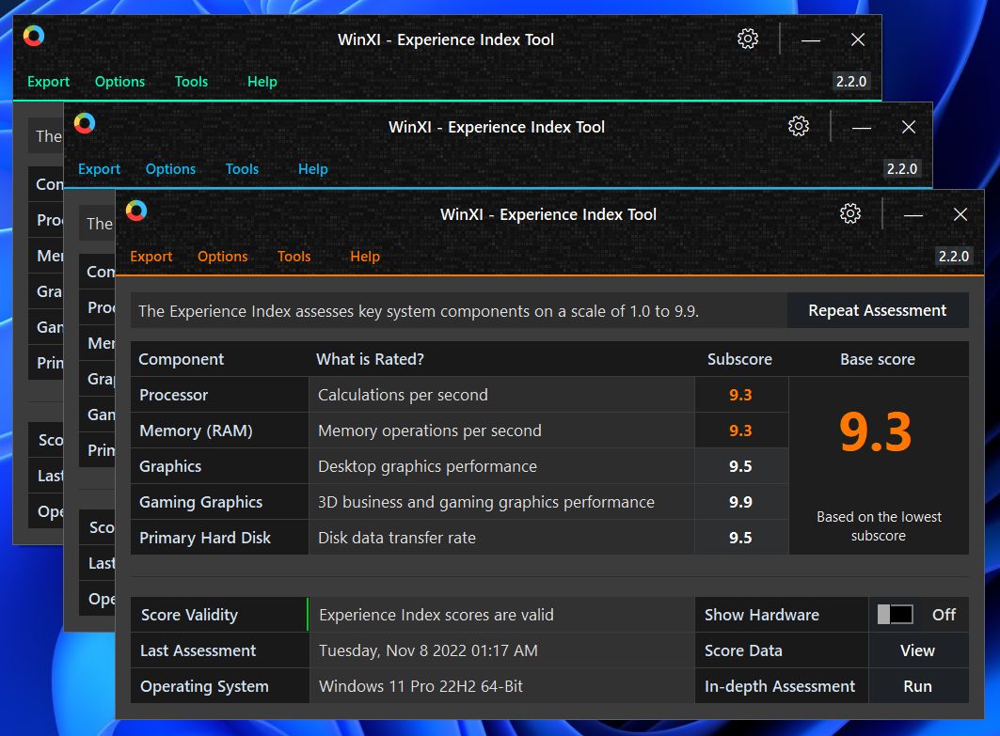

**WinXI**
-

WinXI, formerly known as *Xiret*, is a simple and powerful tool designed to replace the Windows Experience Index User Interface that was removed in Windows 8.1. It features a beautiful, easy to use UI, no adverts or spam, and is completely free forever. It's compatible with all versions of Windows that shipped with the Experience Index, excluding Windows Server. Many applications that imitate the experience index either do not work properly, or have many adverts, so I created something better, and free.

_Key features:-_
- Clean, friendly and easy to use UI built for novice and expert users alike
- View and generate Windows Experience Index scores with minimal effort
- Built using the WInSAT API for high compatibility
- Options to save scores as text or an image
- Imgur API for super simple and immediate upload for sharing
- Automatic power adapter detection
- High DPI support
- In-Depth assessment mode
- Portable with easily managed settings
- Self monitoring for missing resources like fonts and patches
- Option to reset Winsat with one click
- The 'Show Hardware' toggle instantly shows you which hardware was rated

---
**Where did you go? Why WinXI?**
-
I took a long hiatus from software development. I will get this out of the way now, I'm no longer actively writing software, and solely focus on my repair business. I won't be releasing any more major versions of this application, only bug fixing. The only reason this is here is for those who keep asking after it, I'm happy you appreciate this software.

For clarification, WSA, NVReform, and other tools have been scrapped. If someone would like the source code, I'll be happy to send it, however they will not be on Git.

This will be the home of WinXI, and all versioning files, etc, that were on my server will be here.

As for a release deadline, there isn't one, just keep checking in, or watch this repo. Currently, I'm reverting partially applied code and systems I was getting ready for the next version, and catching up with Windows 11 fixes, etc.

And as for the new name, let's face it, Xiret was a shit name from the start.

---

**License**
-

WinXI will be released under the [GNU General Public License v3.0](https://choosealicense.com/licenses/gpl-3.0/).
